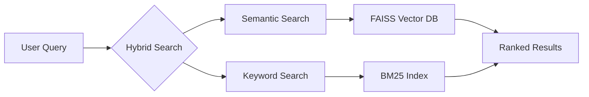

# 🧠 RecipeGPT: The Future of Culinary AI

```ascii-art
╔══════════════════════════════════════════════════════════════════╗
║   ____           _            ____ ____ _____ 
║  |  _ \ ___  ___(_)_ __  ___|  _ \_ _|_   _|
║  | |_) / _ \/ __| | '_ \/ _ \ |_) | |  | |  
║  |  _ <  __/ (__| | |_) |  __/  __/| |  | |  
║  |_| \_\___|\___|_| .__/ \___|_|  |___| |_|  
║                    |_|                         
║      Your AI-Powered Culinary Companion
╚══════════════════════════════════════════════════════════════════╝
```

## 🎯 What Makes This Special?

Most recipe chatbots just match keywords. We're different. Using state-of-the-art RAG (Retrieval Augmented Generation) and LoRA fine-tuning, we understand the *soul* of cooking:

```python
user_query = "I have leftover rice and some vegetables"
context = recipe_brain.understand_ingredients(query)
# Output: Not just a recipe, but a culinary journey...
```

## 🚀 Technical Innovation

### Hybrid Search Architecture


### Advanced RAG Implementation
```python
# This isn't your grandmother's recipe search
class HybridRecipeSearch:
    def search(self, query: str) -> List[Recipe]:
        semantic_results = self.semantic_search(query)
        keyword_results = self.keyword_search(query)
        return self.intelligent_fusion(
            semantic_results, 
            keyword_results
        )
```

## 🎨 Features That Matter

| Feature | Traditional Bots | RecipeGPT |
|---------|-----------------|-----------|
| Search | Keyword Matching | Semantic Understanding |
| Recommendations | Static Rules | Dynamic Context |
| Adaptability | None | Learns from Interactions |
| Security | Basic | Enterprise-Grade |

## 🛠️ Quick Start

```bash
# Clone into culinary innovation
git clone https://github.com/yourusername/RecipeChatBot-AI.git

# Set up your environment
python -m venv venv
source venv/bin/activate  # Windows: venv\Scripts\activate

# Install the magic
pip install -r requirements.txt

# Launch into the future of cooking
uvicorn app.main:app --reload
```

## 🧪 The Science Behind the Magic

Our system uses:
- **RAG (Retrieval Augmented Generation)**: For context-aware recipe understanding
- **LoRA Fine-tuning**: Efficient adaptation of large language models
- **Hybrid Search**: Combining semantic and keyword search for optimal results
- **Context-Aware Generation**: Understanding the nuances of cooking

## 🎭 Real-World Magic

```plaintext
User: "I have chicken and want something Asian-inspired"
RecipeGPT: *understands cultural context, cooking methods, and flavor profiles*
Result: Not just a recipe, but a guided culinary experience...
```

## 🔮 What's Next?

We're not just building a recipe chatbot; we're revolutionizing how AI understands and assists with cooking:

- [ ] Ingredient substitution intelligence
- [ ] Cultural cuisine adaptation
- [ ] Personalized nutrition optimization
- [ ] Advanced cooking technique guidance

## 🤝 Join the Culinary AI Revolution

```python
if you.love(['cooking', 'AI', 'innovation']):
    join_our_community()
```

## 📜 License

MIT License - Because great food, like great code, should be shared.

---

<div align="center">

**Built with 🧠 by AI enthusiasts who love to cook**

[API Docs](http://localhost:8000/docs) | [Contribute](.github/CONTRIBUTING.md) | [Report Bug](../../issues)

</div>
